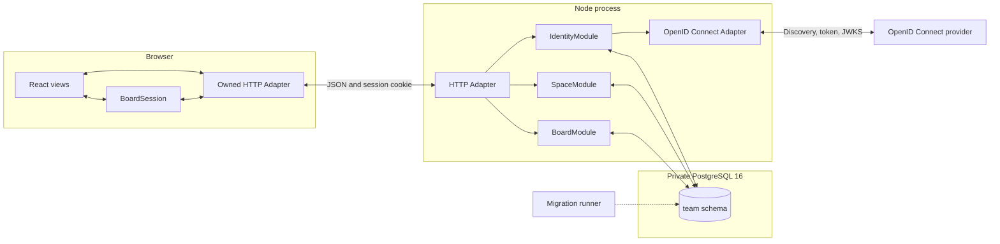

# Architecture

Dig is a React, Node, and PostgreSQL modular monolith. Slices 1 through 3 run authentication, Space membership, lifecycle controls, and Task capture and editing through three server Modules. OpenID Connect is the only true-external dependency.

## Running path

The HTTP Adapter resolves a server session through `IdentityModule`. It passes the resulting opaque `AuthenticatedIdentity` to `SpaceModule`. Board routes request `AuthorizedSpace<'board-read'>` or `AuthorizedSpace<'board-change'>` and pass it to the corresponding Board entry.

`BoardModule` does not trust the initial authorization as a lasting grant. Its PostgreSQL transaction locks and rechecks the Space, Member, session, use, lifecycle, and access revision before reading the Board.

## Module Interfaces

`IdentityModule` has two entries:

- `signIn` begins or completes OpenID Connect sign-in.
- `session` resolves or ends a PostgreSQL-backed browser session.

Its Implementation owns state, nonce, PKCE, identity mapping, secret hashing, expiry, Origin checks, and CSRF. The OpenID Connect port has a production Adapter and a deterministic test Adapter.

`SpaceModule` has three entries:

- `read` returns the Space switcher, Space details, Members, invitation status, and administrative audit.
- `change` owns idempotent Space, invitation, membership, role, archive, restore, and deletion-schedule changes.
- `authorize` creates a request-scoped `AuthorizedSpace` for a named use.

Its Implementation owns Space-key reservation, invitation digests and expiry, the last-administrator rule, access revisions, session effects, audit writes, and lifecycle rules. Access-changing transactions publish an optional invalidation after commit for the live feed added in Slice 6.

`BoardModule` keeps the selected `read`, `change`, and `follow` Interface. Reads now cover overview, Task detail, lane and Archive pages, Subtask pages, and Tag autocomplete. Changes cover capture, revision, family archive, and family restore. The live feed remains Slice 6 work.

The Board transaction rechecks access, locks its Board row to serialize numbering and change sequences, checks the Member-scoped request receipt, validates revisions and relationships, then commits Task state, events, the receipt, and `BoardUpdate`. This lock never covers another Space. Space membership transactions call the Board-owned private unassignment operation before ending membership.

Task pages use indexed Task numbers as the current ordering. Encrypted cursors bind a Space, selection, ordering, and Board sequence. A change, one-hour expiry, or process restart invalidates the cursor and requires a fresh bounded page. Slice 4 replaces Task-number ordering with relative placement.

## Session and sign-in flow

1. The browser posts to `/api/auth/sign-in` from an allowed Origin.
2. `IdentityModule` stores a ten-minute, single-use attempt containing state, nonce, PKCE verifier, safe return path, and a hash of the browser attempt secret.
3. The provider redirects to `/api/auth/callback` with its code and state.
4. The production Adapter exchanges the code, verifies the signed ID token against provider JWKS, and checks issuer, audience, expiry, subject, and nonce.
5. `IdentityModule` maps issuer and subject to a stable identity and creates a server session. The browser receives only a Secure, HttpOnly, SameSite cookie in production.
6. Authenticated reads refresh activity without contacting the provider. The session expires after five days without activity or 30 days after sign-in.
7. Changes require both an allowed Origin and the session's HMAC-derived CSRF token.

## PostgreSQL

The `team` schema contains identities, sign-in attempts, browser sessions, Space-key reservations, Spaces, Members, invitations, administrative audit, Boards, Board Columns, Tasks, Tags, Task/Tag links, Task events, Board updates, and Space and Board idempotency receipts.

Every Board Column carries `space_id`. A composite foreign key guarantees that its Board belongs to the same Space. Partial unique indexes enforce one Intake and one Completion Column per active Board. Database checks enforce valid flow roles and positive Active WIP limits.

The Slice 3 retirement migration drops the unused public-schema prototype tables. Earlier checksummed migrations remain intact for installations that have already applied Slices 1 and 2.

## Browser

`src/team/TeamApp.tsx` handles authentication and Space navigation and management. Its Board renders `src/views/BoardWorkspace.tsx`. `BoardSession` owns Task loading, drafts, cursor pages, connection state, and authoritative receipt reduction. The HTTP Adapter implements `BoardTransport`; tests use an in-memory Adapter at that port.

Task detail loads descriptions separately from lane summaries. A stale edit preserves the draft beside the current Task and requires the Member to choose the current revision before retrying. An uncertain network response preserves the request ID so reconnecting cannot duplicate a capture. The browser pauses changes while disconnected. Server-Sent Events and automatic gap recovery remain Slice 6 work.

## Deployment state

The application image contains the browser build, server build, and migrations. Server startup applies and validates checksummed migrations before listening, including when deployed as a standalone Coolify application. Compose retains its separate migration service; the startup check then finds no pending migrations. PostgreSQL stays on the private container network.

`/health/live` reports HTTP-process liveness. `/health/ready` checks PostgreSQL after startup has completed; the image probes it with Node. Shutdown marks readiness unavailable and allows up to 30 seconds for HTTP and database connections to close. Full mutation drain, backup verification, monitoring, and release hardening remain Slice 9 work.

The app still binds to host loopback in repository Compose. Coolify setup for real-provider sign-in validation precedes further Task development. See [the deployment guide](docs/coolify-deployment.md). Task authorization, rate limiting, operating checks, and the remaining team-release gates are not complete.
