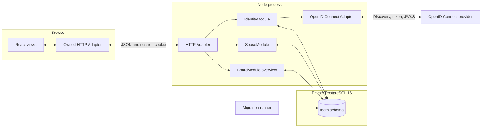

# Architecture

Dig is a React, Node, and PostgreSQL modular monolith. Slices 1 and 2 run authentication, Space membership, lifecycle controls, and the empty Board through three server Modules. OpenID Connect is the only true-external dependency.

## Running path

The HTTP Adapter resolves a server session through `IdentityModule`. It passes the resulting opaque `AuthenticatedIdentity` to `SpaceModule`. Board routes ask `SpaceModule` for an opaque `AuthorizedSpace<'board-read'>` and pass that value to `BoardModule.read`.

`BoardModule` does not trust the initial authorization as a lasting grant. Its PostgreSQL transaction locks and rechecks the Space, Member, session, use, lifecycle, and access revision before reading the Board.

## Module Interfaces

`IdentityModule` has two entries:

- `signIn` begins or completes OpenID Connect sign-in.
- `session` resolves or ends a PostgreSQL-backed browser session.

Its Implementation owns state, nonce, PKCE, identity mapping, secret hashing, expiry, Origin checks, and CSRF. The OpenID Connect port has a production Adapter and a deterministic test Adapter.

`SpaceModule` has three entries:

- `read` returns the Space switcher, Space details, Members, invitation status, and administrative audit.
- `change` owns idempotent Space, invitation, membership, role, archive, restore, and deletion-schedule changes.
- `authorize` creates a request-scoped `AuthorizedSpace` for a named use.

Its Implementation owns Space-key reservation, invitation digests and expiry, the last-administrator rule, access revisions, session effects, audit writes, and lifecycle rules. Access-changing transactions publish an optional invalidation after commit for the live feed added in Slice 6.

`BoardModule` keeps the selected `read`, `change`, and `follow` Interface. Slice 1 implements the empty `overview` read. Task changes and the live feed remain unavailable until their planned slices.

## Session and sign-in flow

1. The browser posts to `/api/auth/sign-in` from an allowed Origin.
2. `IdentityModule` stores a ten-minute, single-use attempt containing state, nonce, PKCE verifier, safe return path, and a hash of the browser attempt secret.
3. The provider redirects to `/api/auth/callback` with its code and state.
4. The production Adapter exchanges the code, verifies the signed ID token against provider JWKS, and checks issuer, audience, expiry, subject, and nonce.
5. `IdentityModule` maps issuer and subject to a stable identity and creates a server session. The browser receives only a Secure, HttpOnly, SameSite cookie in production.
6. Authenticated reads refresh activity without contacting the provider. The session expires after five days without activity or 30 days after sign-in.
7. Changes require both an allowed Origin and the session's HMAC-derived CSRF token.

## PostgreSQL

The `team` schema contains identities, sign-in attempts, browser sessions, Space-key reservations, Spaces, Members, invitations, administrative audit, Boards, Board Columns, and Space idempotency receipts.

Every Board Column carries `space_id`. A composite foreign key guarantees that its Board belongs to the same Space. Partial unique indexes enforce one Intake and one Completion Column per active Board. Database checks enforce valid flow roles and positive Active WIP limits.

The public-schema prototype tables remain temporarily because the working tree already contained Task changes and the old behavior tests still exercise them. The running browser and HTTP Adapter do not use that path. Slice 3 removes it after replacement behavior passes through `BoardModule`.

## Browser

`src/team/TeamApp.tsx` owns the current browser state. It handles sign-in, Space creation and selection, invitation acceptance, Member administration, Space settings and lifecycle, the empty Board, and sign-out. `src/team/team-api.ts` is the owned HTTP Adapter.

The older `TaskContext`, Task views, and client remain in the repository but are not imported by the runtime entry point.

## Deployment state

The application image contains the browser build, server build, and migrations. Compose runs migrations before starting the server. PostgreSQL stays on the private container network.

Readiness/liveness, graceful drain, backup verification, monitoring, and release hardening remain Slice 9 work.

The app still binds to host loopback in repository Compose. Do not publish this build to a public network. Task authorization, rate limiting, operating checks, and the remaining release gates are not complete.
