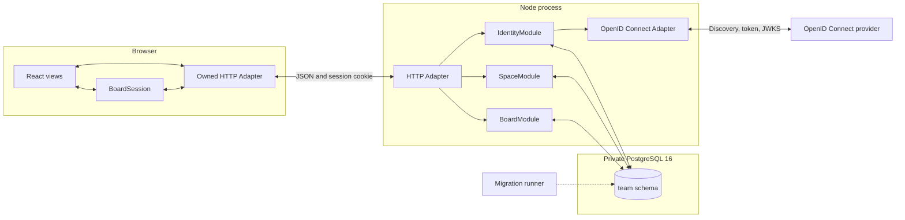

# Architecture

Dig is a React, Node, and PostgreSQL modular monolith. Slices 1 through 7 run authentication, Space membership, lifecycle controls, and Task capture, editing, movement, closure, history, comments, and Notifications through three server Modules. OpenID Connect is the only true-external dependency.

## Running path

The HTTP Adapter resolves a server session through `IdentityModule`. It passes the resulting opaque `AuthenticatedIdentity` to `SpaceModule`. Board routes request `AuthorizedSpace<'board-read'>` or `AuthorizedSpace<'board-change'>` and pass it to the corresponding Board entry.

`BoardModule` does not trust the initial authorization as a lasting grant. Its PostgreSQL transaction locks and rechecks the Space, Member, session, use, lifecycle, and access revision before reading the Board.

## Module Interfaces

`IdentityModule` has two entries:

- `signIn` begins or completes OpenID Connect sign-in.
- `session` resolves or ends a PostgreSQL-backed browser session.

Its Implementation owns state, nonce, PKCE, identity mapping, secret hashing, expiry, Origin checks, and CSRF. The OpenID Connect port has a production Adapter and a deterministic test Adapter.

`SpaceModule` has three entries:

- `read` returns the Space switcher, Space details, Members, invitation status, and administrative audit.
- `change` owns idempotent Space, invitation, membership, role, archive, restore, and deletion-schedule changes.
- `authorize` creates a request-scoped `AuthorizedSpace` for a named use.

Its Implementation owns Space-key reservation, invitation digests and expiry, the last-administrator rule, access revisions, session effects, audit writes, and lifecycle rules. Access-changing transactions publish an optional invalidation after commit for the live feed added in Slice 6.

`BoardModule` keeps the selected `read`, `change`, and `follow` Interface. Reads now cover overview, Task detail, lane and Archive pages, Subtask pages, Tag autocomplete, independently paged comments and Task history, and the recipient's inbox. Changes cover capture, revision, relative placement, Outcome changes, family archive, family restore, authored comments, moderation, and personal Notification read state. The live feed delivers committed Board updates through authenticated Server-Sent Events.

The Board transaction rechecks access, locks its Board row to serialize numbering and change sequences, checks the Member-scoped request receipt, validates revisions and relationships, then commits Task or comment state, events, Notifications, moderation audit when applicable, the receipt, and `BoardUpdate`. This lock never covers another Space. Space membership transactions call the Board-owned private unassignment operation before ending membership.

Column pages use indexed relative ranks with Task numbers as a stable tie-breaker. Archive and Subtask pages retain Task-number ordering. Encrypted cursors bind a Space, selection, ordering, and Board sequence. A change, one-hour expiry, or process restart invalidates the cursor and requires a fresh bounded page. Ranks stay private. Commands name first, last, or a stable neighboring Task ID and the destination Column order revision. Exhausted rank gaps rebalance within that Column under the Board transaction lock. Capture, movement, archive, and restore advance affected order revisions.

Comment pages use immutable insertion ordering with their own Task-scoped cursors. Inbox cursors bind the recipient and their inbox revision. Expired Notifications disappear from reads and unread counts at 90 days; inbox reads also remove that recipient's expired rows. Inbox revisions live in Board-owned `member_inboxes` rows, so Notification creation never upgrades membership locks after acquiring the Board lock.

Opening a Task sends an explicit `markNotificationsRead: true` query flag and marks only the opener's Notifications for that Task read. Ordinary Task lookups and page loads leave read state unchanged. These reads acquire the Board write lock before changing read state and append a Board update when anything changes. This personal read state remains available in an archived Space. Explicit Board changes still require an active Space. Shared updates invalidate inbox queries without exposing inbox contents; read-state projections identify the Member and are filtered before feed delivery.

Closing comments link to their immutable closure event. A forward migration imports existing closure text with its original author and timestamp. Comment edits and tombstones affect the text shown in history while closure identity, time, and Outcome remain unchanged. SpaceModule owns the private moderation audit writer invoked within the Board transaction.

## Session and sign-in flow

1. The browser posts to `/api/auth/sign-in` from an allowed Origin.
2. `IdentityModule` stores a ten-minute, single-use attempt containing state, nonce, PKCE verifier, safe return path, and a hash of the browser attempt secret.
3. The provider redirects to `/api/auth/callback` with its code and state.
4. The production Adapter exchanges the code, verifies the signed ID token against provider JWKS, and checks issuer, audience, expiry, subject, and nonce.
5. `IdentityModule` maps issuer and subject to a stable identity and creates a server session. The browser receives only a Secure, HttpOnly, SameSite cookie in production.
6. Authenticated reads refresh activity without contacting the provider. The session expires after five days without activity or 30 days after sign-in.
7. Changes require both an allowed Origin and the session's HMAC-derived CSRF token.

## PostgreSQL

The `team` schema contains identities, sign-in attempts, browser sessions, Space-key reservations, Spaces, Members, invitations, administrative audit, Boards, Board Columns, Tasks, Tags, Task/Tag links, Task events, comments, mention bindings, Notifications, inbox revisions, Board updates, and Space and Board idempotency receipts. Task rows retain first Active entry, latest Column entry, current closure time, Outcome, and an optional same-Space Duplicate target. Transition, closure, reopening, and Outcome-change events append beside current state.

Every Board Column carries `space_id`. A composite foreign key guarantees that its Board belongs to the same Space. Partial unique indexes enforce one Intake and one Completion Column per active Board. Database checks enforce valid flow roles and positive Active WIP limits.

The Slice 3 retirement migration drops the unused public-schema prototype tables. Earlier checksummed migrations remain intact for installations that have already applied Slices 1 and 2.

## Browser

`src/team/TeamApp.tsx` handles authentication and Space navigation and management. Its Board renders `src/views/BoardWorkspace.tsx`. `BoardSession` owns Task loading, drafts, cursor pages, connection state, and authoritative receipt reduction. The HTTP Adapter implements `BoardTransport`; tests use an in-memory Adapter at that port.

Task detail loads descriptions separately from lane summaries. A stale edit preserves the draft beside the current Task and requires the Member to choose the current revision before retrying. An uncertain network response preserves the request ID so reconnecting cannot duplicate a capture. The browser pauses changes while disconnected. Drag and keyboard Move actions share the same relative placement command. Completion defaults to Completed; the dialog also offers Rejected, Cancelled, and Duplicate. WIP and open-Subtask warnings describe committed changes. History loads independently and preserves actor identity and transition Column snapshots. An uncertain movement or Outcome change keeps its request for explicit retry after reconnection. Comment drafts survive Task navigation and uncertain requests. A stale comment shows the current text beside the retained draft before an explicit retry. The inbox opens Tasks and supports individual and all-read actions. Live updates refresh loaded Task detail, comments, inbox, and Archive pages. Clean fields follow current data; dirty fields retain their draft beside a newer revision. Connection failures pause changes and reload a current snapshot before opening a new feed.

The Task dialog uses shared `Button`, `Dialog`, `AutoTextarea`, and `Tabs` components from `src/ui`. Its palette, spacing, typography, and focus treatment are defined in `design-system.css`; [UI foundations](docs/design/design-system.md) records their use. Column changes save directly from the property, with ordering and alternative closure forms in the actions disclosure. Comments and History share an activity area. The comment composer binds `@` selections to Member IDs and exposes removable notification recipients. Presentation components leave commands and draft state in `BoardSession`.

## Live delivery

`BoardModule.follow` returns a cancellable async iterator. Each pull uses a short PostgreSQL transaction to recheck Space lifecycle, membership, session expiry or revocation, and access revision before reading the next committed update. Idle iterators poll once per second and hold no database connections between polls. The feed reads one update at a time. A missing sequence, a future cursor, or a backlog exceeding 200 updates returns `snapshot-required` and ends that subscription. Board writes retain the latest 1,000 updates per Space.

The HTTP Adapter serves `/api/spaces/:key/board/events`, uses the existing session cookie, rejects foreign Origins, and accepts `after` or `Last-Event-ID`. It sends a ready event, numbered Board events, and ten-second heartbeat comments. Slow socket writes time out after five seconds. Shutdown sends `server-draining` and releases subscriptions before the server closes its database pool.

The browser's owned Adapter reads the event stream with fetch so BoardSession controls reconnection and snapshot ordering. Twenty seconds without stream bytes counts as a lost connection. Reconnect retries back off from one to ten seconds. Disposing the view or switching Space cancels the stream and timers. Archived Spaces remain readable after recovery without restarting an active feed; lost membership stops automatic retries after authorization fails.

## Deployment state

The application image contains the browser build, server build, and migrations. Server startup applies and validates checksummed migrations before listening, including when deployed as a standalone Coolify application. Compose retains its separate migration service; the startup check then finds no pending migrations. PostgreSQL stays on the private container network.

`/health/live` reports HTTP-process liveness. `/health/ready` checks PostgreSQL after startup has completed; the image probes it with Node. Shutdown marks readiness unavailable and allows up to 30 seconds for HTTP and database connections to close. Full mutation drain, backup verification, monitoring, and release hardening remain Slice 9 work.

The app still binds to host loopback in repository Compose. Coolify setup for real-provider sign-in validation precedes further Task development. See [the deployment guide](docs/coolify-deployment.md). Task authorization, rate limiting, operating checks, and the remaining team-release gates are not complete.

## Workflow and scheduled retention

Slice 7 implements atomic administrator workflow changes through `BoardModule.change(set-workflow)` and a bounded `read(workflow)`. Workflow projections update open Boards while settings drafts retain their base revision. Column archive preserves identity, and restoration restores the previous non-terminal role and WIP limit.

`api/runtime/maintenance.ts` runs private Board archive and Space deletion operations on startup and every minute. Each operation owns its PostgreSQL transaction and follows the established lock order. Automatic archive uses Space-local dates and preserves families and history; system actors have null Member IDs. Permanent deletion cascades scoped receipts and clears the key reservation's identity reference. Shutdown awaits maintenance before closing the pool. [Slice 7 notes](docs/implementation/slice-07-workflow-retention.md) define batch limits, retry behavior, and the restored-Task retention window.
