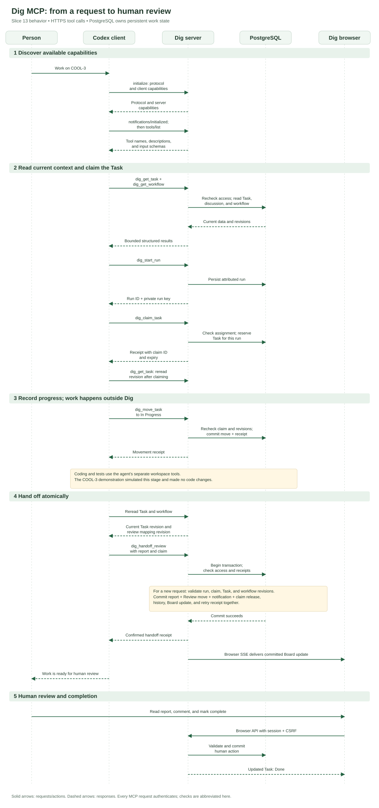
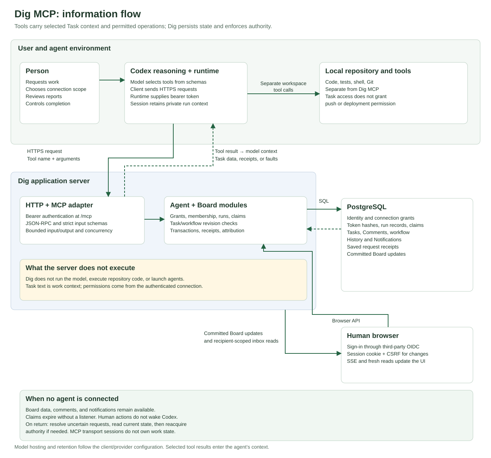

# How Dig's MCP works

Dig exposes selected tracker operations to an external coding agent through the Model Context Protocol, or MCP. A person asks the agent to work on a Task. The agent reads its context, claims it, records progress, and submits a report for human review. Dig checks permission on each request and keeps the work state in PostgreSQL.

This document describes the implementation through Slice 13, commit `46cbb23`, and the production COOL-3 simulation on 2026-09-17. Slice 14 still covers combined client compatibility and extended absence/recovery verification. For connection instructions, use [Connect Codex to Dig](agent-setup.md).

## Diagrams

Both diagrams are standalone SVG files. Markdown viewers can display them directly; open the linked SVG for a full-size view. They contain selectable text and accessible titles/descriptions, with no external fonts, scripts, or rendering service.

### Request sequence



[Open the sequence diagram](diagrams/dig-mcp-sequence.svg)

The diagram abbreviates repeated checks. Every MCP HTTP request authenticates independently. The work operations also recheck the relevant Space, membership, connection, run, and claim inside the change transaction.

### Information flow



[Open the information-flow diagram](diagrams/dig-mcp-information-flow.svg)

The agent environment includes the client runtime and model reasoning. Their physical location depends on the client and provider configuration. Data returned by a tool becomes available to the agent's reasoning context. This diagram does not imply that the language model runs on your laptop or that all tool results remain on it.

## 1. What MCP supplies, and what Dig supplies

MCP defines how a client discovers capabilities and invokes tools using structured messages. A tool advertises its name, description, and input schema. The model can use those definitions to select an operation and supply arguments. The client performs the actual network request. See the [MCP tool specification](https://modelcontextprotocol.io/specification/2025-06-18/server/tools).

Dig supplies the product rules behind those tools: which Spaces a connection can access, whether it can write, who owns a claim, which revisions are current, and what a review handoff does. MCP itself does not define Task claims or guarantee that a report and notification commit together. Those are Dig behaviors.

| Component | Responsibility |
|---|---|
| Person | Authorizes work, grants connection access, reviews results, decides completion |
| Codex model and client | Interpret the request, select tools, send calls, use returned context |
| Optional Dig skill | Guides read/work behavior, honest reporting, and recovery |
| MCP/HTTP adapter | Authenticates transport requests, exposes schemas, validates and translates inputs |
| Agent module | Manages connections, selected grants, authentication, reads, and run identity |
| Board module | Enforces Task rules, claims, revisions, reports, notifications, and receipts |
| PostgreSQL | Persists the state and commits related changes together |
| Dig browser | Presents current state and lets people keep working independently |

The skill is guidance, not an authorization mechanism. A client that ignores it still encounters the server's permission and consistency checks. Task descriptions and comments are untrusted work content; they cannot grant new permissions.

## 2. Connection and tool discovery

Dig's remote endpoint is `https://dig.smidigbommen.no/mcp`. The client uses HTTPS with JSON-RPC messages through Streamable HTTP. Dig currently accepts POST at this endpoint and does not offer a persistent GET event stream for agents. It creates a stateless MCP handler for a request. Durable work state lives in the database, independently of the transport session.

MCP's transport specification permits a server to reject a GET stream with HTTP 405. Streamable HTTP does not require a permanently connected listener. See the [transport specification](https://modelcontextprotocol.io/specification/2025-06-18/basic/transports).

The tested Codex connection negotiates MCP version `2025-06-18`. Its initial exchange is:

1. `initialize`: exchange protocol version and client/server capabilities.
2. `notifications/initialized`: the client acknowledges initialization.
3. `tools/list`: discover the tools available to this connection.
4. `tools/call`: invoke a named tool with structured arguments.

This follows the [MCP lifecycle](https://modelcontextprotocol.io/specification/2025-06-18/basic/lifecycle). A connection with `tasks:read` discovers six tools. A connection with `tasks:work` discovers all sixteen, including the same six reads.

Tool discovery can be cached by a client. During our COOL-3 demonstration, the active session's list still described the previous release. A fresh MCP client discovered the deployed handoff tool. Updating Dig therefore does not guarantee that an already-open client immediately refreshes its tool list.

## 3. Authentication and permissions

A person signs into Dig through the existing third-party OpenID Connect provider. They create a named agent connection in the browser and choose its Spaces and permission. Dig issues a token once, stores its hash, and gives it a 30-day lifetime.

For MCP requests, the client runtime supplies that token in the `Authorization: Bearer …` header. In our setup, it comes from `DIG_TOKEN`. Browser cookies do not authenticate MCP, and the token does not belong in tool arguments or Task content. The agent does not need the person's third-party login credentials.

Dig checks the token, expiry, revocation, current connection revision, selected Space grant, membership, Space access policy, and lifecycle as applicable. Work additionally requires explicit `tasks:work` scope and enabled agent work settings with a valid review destination. Discovering a tool is not proof that a later call will be permitted; access can change between those requests.

A work token includes read access. Replacing a token preserves its selected permissions and immediately invalidates the previous credential and its existing runs. Replacing a read token does not upgrade it to work permission. A public connection ID identifies a connection; it is not a substitute for the secret token.

The browser uses a separate path. Human operations use a session cookie and, for changes, Origin/CSRF checks. They still enter the same domain rules and database. Human access does not depend on an active agent connection.

## 4. The available tools

| Tool | Purpose |
|---|---|
| `dig_list_spaces` | List currently accessible selected Spaces |
| `dig_get_space` | Read Members, Columns, counts, and one Task sample per Column |
| `dig_search_tasks` | Search Task keys/text with bounded pages |
| `dig_get_task` | Read Task details, discussion, history, Subtasks, and current claim |
| `dig_list_tags` | Read available Tags |
| `dig_get_workflow` | Read Columns, revisions, limits, and review mapping |
| `dig_start_run` | Establish a distinct attributed work session |
| `dig_claim_task` | Reserve an open Task for that run |
| `dig_renew_claim` | Extend the current claim while actively working |
| `dig_release_claim` | Release the reservation without review handoff |
| `dig_create_task` | Create and claim a Task; Subtask creation also needs its parent's claim |
| `dig_update_task` | Change title, description, or Tags with the current Task revision |
| `dig_add_comment` | Post relevant progress on a claimed Task |
| `dig_move_task` | Record ordinary progress to a permitted non-Completion Column |
| `dig_report_blocker` | Post a blocker, notify the delegating person, and release the claim |
| `dig_handoff_review` | Post a report, move to Review, notify, and release the claim |

Agents cannot close Tasks, administer Spaces or workflows, moderate comments, or access the human inbox through these tools. Reading a Task through MCP does not mark your notifications read. Ordinary movement into the configured review destination requires the explicit handoff operation.

## 5. What travels in a call

For a read, the JSON-RPC request body can look like this:

```json
{
  "jsonrpc": "2.0",
  "id": 42,
  "method": "tools/call",
  "params": {
    "name": "dig_get_task",
    "arguments": {
      "key": "COOL-3"
    }
  }
}
```

The bearer token is a transport header, so it is absent from this JSON. The `id` correlates this protocol request with its response.

Dig returns a result envelope in MCP `structuredContent`, with a JSON text representation for client compatibility. A successful read contains `ok: true` and the requested view. An expected failure contains `ok: false` and a typed fault. Authentication, invalid protocol inputs, and domain conflicts are distinct failure layers; HTTP 200 alone does not mean a Task operation succeeded.

A work request carries additional fields as needed:

| Field | Meaning |
|---|---|
| `spaceKey`, `taskId` | Target Space and stable Task identity |
| `runId` | Public attribution for this work session |
| `runKey` | Private proof belonging to the run's starting session |
| `claimId` | Current reservation for this particular Task |
| `requestId` | Identity of one intended mutation, retained for retries |
| `expectedRevision` | Task revision the operation was prepared against |
| `expectedOrderRevision` | Destination ordering revision for an ordinary move |
| `expectedWorkflowRevision` | Workflow version used to prepare a review handoff |

The JSON-RPC `id` and Dig's mutation `requestId` have different jobs. A retry can use a new protocol message ID while keeping the same mutation `requestId` and arguments. That lets Dig recognize work it already committed.

## 6. Runs, claims, and human edits

A named connection can serve more than one work session. Each session starts a distinct run. The server returns a public run ID and private run key; public attribution alone cannot authorize changes. The random start request ID also stays private because retrying it can recover the run key.

A claim belongs to one run and one Task. It lasts two hours and needs explicit renewal while work continues. Its effective authority cannot outlive the credential. Claiming unassigned work assigns it to the delegating Member. It does not steal a Task assigned to somebody else. Concurrent attempts serialize so only one run gets the reservation.

Claims reserve agent writes. People can still edit the Task. If a person changes a revisioned field after the agent read it, a stale agent edit fails instead of overwriting the new value. The agent must reread and preserve the human change. Overlapping edits or a changed work scope require the person's decision.

Human reassignment, closure, archive, or authorized claim release ends the reservation. A renewed connection or reopened Task does not revive an old claim. A parent claim also does not grant writes to its existing Subtasks; each child needs its own claim.

## 7. Review handoff and blocker transactions

Before handoff, the agent reads the current Task and workflow. The review destination is a stable Column ID configured by an administrator. Dig does not infer it from a Column named “Review”. The selected Column must exist and must not be the Completion Column.

For a new review handoff, the Board transaction validates access, the run, claim, Task revision, and workflow revision. It then commits:

1. A report Comment with summary, verification outcome/details, limitations, and optional PR or commit reference.
2. Movement to the configured review Column, if the Task is not already there.
3. An inbox notification for the delegating person and normal notifications for explicit mentions.
4. Claim release, attributed history, a Board update, and a saved request receipt.

All of these succeed together or roll back together. For example, an invalid mentioned Member cannot leave the Task moved with no report or notification.

Verification explicitly distinguishes `passed`, `failed`, and `not-run`. These are statements made by the reporting agent. Dig does not execute the tests or independently certify their result. Reports use ordinary Comment editing/removal semantics with an origin label and edited indicator; they are not immutable verification certificates.

A blocker uses the same transaction pattern but leaves the Task in its current Column. It states what is blocked and what help is needed, notifies the delegating person, and releases the claim. Resuming requires reading current context and acquiring a fresh claim.

Delegated report notifications intentionally reach the person even though the action is attributed to them via the agent connection. Ordinary human self-notifications remain suppressed.

## 8. Lost responses, reconnects, and absence

Consider a handoff that commits successfully, followed by a network failure before the response reaches Codex. The agent cannot conclude that nothing happened. It retries the original request ID and exact arguments.

Dig rechecks current credential and Space access, then looks for the stored receipt before demanding an active claim for a new mutation. If that handoff already committed, it returns the original receipt despite the claim having been released. It does not create a second report or notification. Reusing the request ID with different arguments returns a conflict.

| Situation | Expected behavior |
|---|---|
| Response lost after commit | Retry exact request; receive original receipt |
| Human edited the Task | Reject stale revision; reread and reconcile |
| Review mapping changed | Reject stale workflow; preserve report locally and reread |
| Claim expired or was released | Stop writes under it; reread and explicitly reclaim if appropriate |
| Token replaced or revoked | Old credential/run cannot continue; restore access before new work |
| Agent work disabled | End claims and reject new work; read access can remain available |
| Codex returns days later | Load current persisted context before deciding what to do |

Dig does not need an agent listener to expire authority. Closing Codex does not remove Tasks, comments, reports, or notifications. A person's comment, assignment, or movement does not wake an agent. When you told me you added a comment to COOL-3, I made a fresh read; Dig had not pushed that comment into the conversation.

A browser can still show live changes. Its authenticated Server-Sent Events feed reads committed Board updates, and the browser refreshes relevant views. This feed is separate from the agent MCP transport.

## 9. What information persists, and where

| Information | Location and flow |
|---|---|
| Task text, comments, history, workflow | Stored in Dig; selected bounded views return to the agent |
| Bearer token | Held by the configured client environment/credential mechanism; Dig stores its hash |
| Run key and pending retry arguments | Retained privately by the agent session for work and recovery |
| Public run and connection IDs | Used for attribution; can appear in history and reports |
| Claims and request receipts | Persisted in Dig, independent of the client connection |
| Source code and test output | Handled by the coding client's separate workspace tools; Dig sees only content explicitly submitted to it |
| Human notifications | Stored in Dig and read through the human browser path |
| Request logs | Record operational metadata without intentionally logging bearer tokens, run keys, or request content |

The data exposed to the model depends on the tools called and pages requested. A Space overview supplies counts and one sample Task per Column, not the entire Board. Comments, history, and Subtasks have separate pagination. Access to a Task does not imply permission to publish code, push a branch, or deploy software.

## 10. Bounds and operational limits

These values describe this implementation, not requirements imposed by MCP:

| Limit | Current value |
|---|---|
| Read page size | Defaults to 10; maximum 50 items |
| MCP JSON request body | Maximum 64,000 bytes |
| Serialized tool-result envelope | Maximum 750,000 bytes |
| Concurrent MCP requests | Four per application process |
| Authenticated request budget | 60 per connection and 120 per identity per minute, per process |
| MCP request-body deadline | 15 seconds |
| Connection token lifetime | 30 days |
| Claim lifetime | Two hours, subject to credential validity |
| Report mentions | Maximum 25 Members |
| Ordinary Comment text | Maximum 5,000 characters |

The request budgets include authenticated protocol requests, not just successful Task mutations. There are also HTTP request protections and database lock/statement timeouts. These process-local limits are not a distributed quota across multiple application instances. Rate-limited clients should respect `Retry-After`.

Large results return a bounded error. For uncertain writes, the client must resolve the original request ID rather than repeat the action under a new one. For reads, it should request smaller pages. A cursor can expire after intervening changes; restart that read and reconcile current state.

## 11. What the COOL-3 simulation demonstrated

The production exercise performed this sequence:

1. Read an unassigned COOL-3 in Backlog and an enabled review mapping.
2. Start a run and claim the Task, assigning it to the delegating person.
3. Move it to In Progress.
4. Submit a review report explicitly labelled as a simulation, with verification `not-run`.
5. Commit the Review move, report, notification operation, and claim release through a confirmed handoff receipt.
6. Read the Task again and confirm Review, the report, and no active claim.
7. After your message, read your “Perfect! closing the task” comment and the human completion event in Done.

No code was implemented or tested in that exercise. It demonstrated the production workflow and human closure. It did not independently inspect the private inbox through MCP, and it does not establish all the extended-absence and client recovery scenarios planned for Slice 14.

## Implementation and protocol references

- [MCP tool adapter](../api/adapters/mcp/handler.ts): available tools, schemas, descriptions, result envelope.
- [HTTP server](../api/server.ts): endpoint, authentication entry, body and concurrency limits.
- [Agent module](../api/modules/agent/agent-module.ts): connection permissions, run identity, bounded reads.
- [Board module](../api/modules/board/board-module.ts): transactional checks, receipt lookup, changes.
- [Claim rules](../api/modules/board/private-claims.ts): reservation ownership and authorization.
- [Report operation](../api/modules/board/private-agent-reports.ts): report, movement, notification, release.
- [Dig work skill](../skills/dig/references/work.md): expected client behavior and recovery.
- [Slice 13 implementation evidence](implementation/slice-13-agent-handoff.md) and [remaining delivery plan](design/agent-access-slices.md).
- Official MCP version `2025-06-18`: [lifecycle](https://modelcontextprotocol.io/specification/2025-06-18/basic/lifecycle), [tools](https://modelcontextprotocol.io/specification/2025-06-18/server/tools), and [Streamable HTTP](https://modelcontextprotocol.io/specification/2025-06-18/basic/transports). These links describe the version tested with our Codex CLI, not a claim that it is the newest protocol revision.
